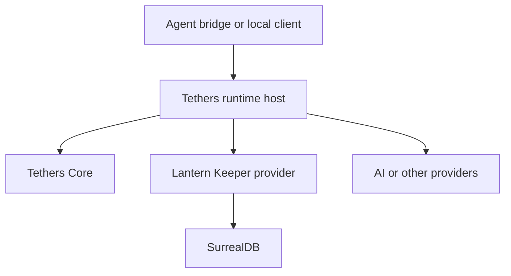

# Tethers and Lantern Keeper — Canonical Architecture

Status: build foundation
Owner and final authority: Matthew
Date: 21 July 2026

## 1. Decision

Tethers and Lantern Keeper are two independent systems that become useful together.

- **Tethers coordinates behaviour.** It turns an Anchor plus immutable Facts into a deterministic Plan of typed capability calls and explains the decision in the Trail.
- **Lantern Keeper owns memory.** It stores sources, interaction history and durable memories; preserves provenance; retrieves relevant context; and applies memory invariants when information is proposed, reinforced, corrected, superseded or archived.
- **AI supplies bounded semantic judgement.** It interprets meaning, proposes memories, classifies ambiguous material and prepares structured results. It is never an invisible authority.
- **Matthew is the root authority.** Local configuration determines which providers, Tether Sets and effects are permitted. AI and discovered software cannot grant themselves permission.

The short version remains:

> Lantern Keeper remembers. Tethers coordinates. AI interprets. Matthew decides.

Neither project should absorb the other. Lantern Keeper is the first serious capability provider for Tethers, not a special feature inside the Tethers language. Tethers is the behaviour layer used by Lantern Keeper workflows, not Lantern Keeper's storage engine.

## 2. What this report corrects

The previous architecture was directionally sound but too divided. It turned every runtime concern into a named layer and nearly every layer into a milestone. That would produce more interfaces than working behaviour.

This report makes the following corrections:

1. **Provider trust, manifest admission, live availability and Tether Set projection form one admission path.** They are distinct checks, not four services.
2. **Permission, dispatch, outcome handling and Trail writing form one execution state machine.** They are not separate products.
3. **A Tether Set declares the capabilities it requires; it does not make those capabilities exist.** Providers expose capabilities. The local host binds them.
4. **AI does not run secretly inside a Condition.** An AI call is an Action. Its result becomes a new Anchor whose Facts can be evaluated deterministically by another Tether.
5. **The Trusted Manifest Store is not a second database or historical registry.** It holds verified capability contracts used by the running host. Live callability is derived from current connection and policy state.
6. **Lantern Keeper begins with five durable concepts, not a miniature ontology.** Source, Episode, Memory, Project and Link are enough for the first real system.
7. **Tasks, decisions, preferences, constraints and ideas begin as Memory kinds, not separate storage subsystems.** They earn specialised records only when real behaviour requires them.
8. **Fading is a retrieval effect, not destructive background rewriting.** Old memories rank lower unless their importance, links or reinforcement keep them relevant; they remain retrievable.
9. **Embeddings are optional later recall machinery.** Exact project scope, provenance, full-text search, recency and graph links must work first.
10. **There is one early vertical slice.** We do not finish a dozen horizontal frameworks before forcing a real Anchor through planning, permission, execution and Trail.

## 3. Canonical system shape



The components may be separate local processes because Tethers Core is OCaml and the reference host and Lantern Keeper are Rust. That is an implementation fact, not a reason to make the user operate a collection of services. One local launcher should eventually start and inspect them.

MCP and the versioned Tethers JSON protocol are cables between components. They do not define the domain model and do not grant trust or permission.

### 3.1 Components and ownership

| Component | Owns | Must not own |
| --- | --- | --- |
| Tethers Core | Parsing, structural validation, Anchor matching, Condition evaluation, Action planning, deterministic evaluation Trail | Live I/O, provider discovery, permission grants, retries, application data, hidden AI judgement |
| Tethers runtime host | Provider connections, manifest admission, effective policy, serial dispatch, idempotency records, execution Trail, result events | Application-specific memory rules, a second interpretation of Tether syntax |
| Tether Set | Versioned Tethers, accepted Anchors, exact capability requirements, set-level configuration and requested policy | Provider credentials, self-granted permission, executable application code |
| Capability provider | A typed operation and its actual implementation | Authority to approve itself or rewrite Tethers policy |
| Lantern Keeper | Sources, Episodes, Memories, Projects, Links, provenance, memory mutation rules, retrieval and context packs | General workflow semantics or arbitrary external actions |
| AI provider | Narrow structured interpretation, classification, drafting, reranking or explanation | Identity checks, schema checks, permission, retries, storage invariants |
| Agent bridge | Passing the current request to context retrieval and returning the completed interaction for intake | Pretending an unintegrated client was observed |
| HQ | Later editing, testing and Trail inspection over the canonical rule representation | A second rule model |

## 4. Tethers: the smallest complete design

### 4.1 The language core

Tethers Core knows only the general model:

- Anchor: the named event that starts evaluation;
- Facts: the immutable supplied values Conditions may inspect;
- Conditions: deterministic tests over Facts;
- Actions: ordered requests to invoke Capabilities;
- Capabilities: typed operations described to the engine;
- Plan: the ordered Actions produced by evaluation;
- Trail: the causal explanation of evaluation, later extended by the host.

It has no built-in meaning for memory, MCP, Git, files, ChatGPT, Codex, Cline, email or Lantern Keeper. Those meanings enter only through events, Facts and Capabilities.

The existing 0.1 language rules remain correct:

- immutable inputs;
- exact and visible operators;
- no loops, arbitrary functions, mutation or hidden I/O;
- no direct use of one Action's result by the next Action;
- sequential Actions;
- exact compatible versions rather than `latest` or guessed upgrades;
- false Conditions produce `not_matched`, not errors;
- Tethers plans; hosts authorise and execute.

### 4.2 Tether Sets

A Tether Set is the installable behavioural unit. It contains:

- a set identity and exact version;
- ordered Tether source files;
- the Anchors it accepts or emits;
- exact capability name/version requirements;
- non-secret configuration declarations;
- requested permission scopes and human-readable reasons;
- fixtures proving its important paths.

Installation may also recommend provider adapters, but the set does not smuggle executable code or permission into Tethers Core. The host separately configures providers and decides the effective policy.

The effective capability view for a set is the intersection of:

```text
verified provider manifest
AND configured provider binding
AND live connection
AND exact Tether Set requirement
AND local policy
```

Only that derived view is supplied to evaluation and dispatch.

### 4.3 Provider and capability admission

This is one host operation, not a stack of registries.

For each explicitly configured local provider, the host:

1. starts or connects to the configured endpoint;
2. binds that connection to the provider ID from local configuration;
3. receives the provider's manifest;
4. verifies the manifest and its calculated digest;
5. checks that the provider is permitted to expose that exact capability and version;
6. optionally checks a locally pinned digest;
7. inserts the verified manifest into the Trusted Manifest Store;
8. exposes a derived live capability entry while that bound connection remains available.

No certificate authority, account service or remote trust system is needed for the local 0.1 threat model. The important trust fact is the local binding between configured provider ID, endpoint and allowed capabilities. A provider's own identity claim is descriptive, not proof.

Discovery never grants permission. A manifest describes what could be called. Local policy decides whether it may be called.

### 4.4 Capability contract

A capability contract needs only information the host can enforce:

- exact name and version;
- input and output schema;
- declared external effects;
- resource-scope shape where applicable;
- whether the operation is read-only, idempotent with a key, or potentially non-idempotent;
- provider binding metadata;
- timeout limit or supported deadline behaviour;
- fields that must be omitted or redacted from the Trail.

Human confirmation and permanent permission are host policy, not powers granted by the manifest. Reversibility may be useful descriptive metadata, but it does not make an Action safe and must not drive automatic undo in 0.1.

### 4.5 Execution state machine

The runtime host executes one Anchor at a time. Tethers and Actions use stable declared order.

For every planned Action, the host performs:

1. Resolve the exact capability and live bound provider.
2. Revalidate the Action arguments against the trusted input schema.
3. Calculate effective permission from host policy, set declaration, provider binding and resource scope.
4. Deny, request one-shot approval, or continue.
5. Assign stable execution and Action identifiers plus the idempotency key.
6. Append and flush an intent entry to the Trail before any effectful call.
7. Call the provider once with a deadline.
8. Classify the outcome as `succeeded`, `failed` or `uncertain`.
9. Validate a received success value against the trusted output schema.
10. Persist the idempotency/outcome record and append the outcome Trail entry.
11. Emit a result Anchor containing the structured outcome and correlation IDs.

For 0.1 there are **no automatic retries**. This removes an entire class of duplicate effects. A later capability may support safe retry with the same idempotency key, but that must be proved end to end before enabling it.

If the call may have reached the provider but no trustworthy response arrives, the result is `uncertain`. Tethers must not rename uncertainty as failure or retry it blindly.

If intent cannot be durably written, an effectful Action does not run. If the Action completes but the final Trail write fails, the host reports a distinct audit failure without changing the known Action outcome.

### 4.6 Result events, AI and multi-step behaviour

Tethers 0.1 deliberately does not let Conditions call live services or Actions consume earlier Action results. Multi-step workflows therefore use events:

```text
Anchor A
→ deterministic Tether
→ Action: ai.judge
→ provider result
→ Anchor B: capability.succeeded
→ deterministic Tether
→ Action: lantern.memory.propose
```

This is not a workaround. It is the mechanism that preserves determinism and makes each uncertain boundary visible in the Trail.

The host creates exactly one of three standard result Anchors for every attempted call:

```text
capability.succeeded
capability.failed
capability.uncertain
```

The immutable event envelope contains `event_id`, `event_name`, `producer`, `correlation_id`, `causation_id`, `generation` and host-supplied `occurred_at`. Its Facts contain the original evaluation and Action IDs, capability name/version, manifest digest, provider ID and either the validated result or structured error. A Tether interested in `ai.judge` matches the standard Anchor and tests `capability.name` in the supplied Facts. Providers may introduce domain events later, but Action chaining does not depend on provider-specific event naming.

Generated events are queued serially.

To prevent runaway causal loops, the host deduplicates event IDs and enforces a small configured causal-depth limit. The first joint implementation should use a maximum depth of eight and fail visibly when it is exceeded.

### 4.7 Permission model

Matthew is the local root authority. The useful 0.1 outcomes are:

- `allow`: pre-authorised by local policy for this set, capability and resource scope;
- `ask`: pause for a one-shot decision tied to the exact Action and argument digest;
- `deny`: explicitly prohibited;
- `unavailable`: no currently valid provider binding.

Harmless local reads may be pre-authorised by scope. External communication, destructive file operations and other consequential effects should default to `ask` or `deny` until explicitly scoped.

AI may explain a request or recommend a choice. It cannot approve its own Action.

### 4.8 Trail

There is one causal Tethers Trail per execution, with entries from both Core and host. It records:

- accepted Anchor and immutable Fact snapshot digest;
- Tether Set, Tether and version;
- Anchor and Condition outcomes;
- planned capability identity, version and manifest digest;
- permission decision;
- intent, attempt and outcome;
- result event IDs;
- failures and uncertainty.

The Trail should be append-only JSON Lines for the first implementation. It should store identifiers, safe summaries, digests and references by default rather than duplicating entire conversations, files or secrets. Lantern Keeper stores source material; the Trail points to it when appropriate.

Timestamps belong to host entries. Pure Core evaluation entries remain deterministic and timestamp-free.

## 5. Lantern Keeper: the smallest useful memory system

### 5.1 Purpose

Lantern Keeper exists so Matthew does not have to reconstruct project context for every AI or act as the filing clerk for every useful thought. It retains the right material, preserves the route back to what actually happened and returns a small, relevant context pack before work begins.

It is not:

- a replacement for every platform's private conversation history;
- a general notebook;
- a vector-database demonstration;
- an autonomous agent;
- an AI operating system;
- the hub through which all tools must pass.

It only knows interactions that an integration explicitly submits. A local service cannot magically observe ChatGPT, Codex, Cline or any other client that does not call it. Each supported client needs a bridge, wrapper or MCP integration for the before-and-after transaction.

### 5.2 Five durable concepts

| Concept | Meaning |
| --- | --- |
| Project | A stable scope that gathers work, context and current state |
| Source | An external artefact or exact imported material: file, document, page, message or reference |
| Episode | One bounded interaction or work transaction, including request, response and relevant tool/result references |
| Memory | One durable, retrievable item derived from a Source or Episode |
| Link | A typed relationship between Projects, Sources, Episodes and Memories |

The first Memory kinds should be a controlled enum:

```text
fact
decision
constraint
preference
idea
task
finding
experience
```

These kinds affect retrieval and presentation. They do not justify separate tables yet.

A Memory holds:

- stable ID and project scope;
- kind and concise content;
- state: `active`, `superseded` or `archived`;
- controlled confidence (`confirmed`, `supported`, `inferred`, `disputed`) and importance (`core`, `normal`, `peripheral`) labels;
- creation and observation times;
- provenance references to exact Source/Episode locations;
- reinforcement count and last-reinforced time;
- links to relevant items;
- revision/supersession references where applicable.

`proposed` is an intake state, not a durable-memory state. Rejected proposals do not become memories. A short audit record may note the decision without polluting retrieval.

A separate Marker object is unnecessary at first. Provenance can carry a source locator such as message ID, byte range, heading or page. Add a Marker entity only if shared annotations or UI behaviour later require one.

The first Link kinds are deliberately limited:

```text
derived_from
supports
contradicts
supersedes
depends_on
part_of
associated_with
```

`associated_with` is the escape hatch and should be used only with a short explanation. Named people, tools and concepts may initially be normalised entity keys on Memories; they do not need their own record system until identity resolution or entity-specific behaviour earns it.

### 5.3 Authority and provenance

The Source or Episode remains authoritative evidence. A Memory is an interpretation of it.

- Raw imported content is immutable.
- Corrections create a new revision or Memory; they do not rewrite the historical source.
- Every durable Memory must have provenance unless Matthew explicitly creates a standalone note.
- A generated summary never becomes more authoritative than its sources.
- Retrieval returns source references with memories so claims can be checked.
- Permanent deletion is an explicit maintenance operation; ordinary removal uses archive or supersession.

### 5.4 Intake

Lantern Keeper exposes a judgement boundary such as `lantern.memory.propose`; it does not expose an unrestricted `insert row` capability.

The minimum public capability surface is:

| Capability | Purpose |
| --- | --- |
| `lantern.context.retrieve` | Return a budgeted, sourced context pack for a project and request |
| `lantern.episode.record` | Store one completed interaction transaction immutably |
| `lantern.memory.propose` | Apply duplicate, reinforcement, conflict and supersession rules to a candidate |
| `lantern.memory.get` | Retrieve an exact memory and its provenance |
| `lantern.memory.search` | Search within explicit project/state limits |
| `lantern.memory.archive` | Archive a specified memory under local permission |

Database insert/update operations are internal and never become Tethers capabilities.

For each proposal it:

1. validates the structured candidate and provenance;
2. searches plausible existing memories in the same or linked project;
3. classifies the candidate as new, reinforcing, correcting, superseding, conflicting or insufficient;
4. applies deterministic invariants;
5. creates, reinforces, links or queues the proposal for Matthew;
6. returns the exact outcome and affected IDs.

AI may recommend the semantic classification, candidate wording, kind and links. Lantern Keeper still enforces:

- valid provenance;
- no mutation of immutable source material;
- no silent replacement of a conflicting memory;
- explicit supersession links;
- stable IDs and revision history;
- project and access boundaries.

There are three intake routes:

1. **Matthew explicitly says to remember something.** Treat this as authoritative intent to retain it. Still attach provenance and check for reinforcement or supersession rather than creating duplicates.
2. **Deterministic Tether rules identify an obvious structured event.** Route it directly to `lantern.memory.propose`.
3. **Meaning is ambiguous.** A Tether calls an AI assessment capability. The structured result must be one of `retain`, `ask` or `ignore`, with candidate memories, evidence and reasons. A second Tether routes that result. Confidence is advisory; it is not permission.

An ignored durable-memory proposal does not erase the Episode. The interaction remains available through its project history according to retention settings.

### 5.5 Retrieval

Retrieval is a concrete pipeline, not “ask the AI what is relevant.”

1. Accept a query containing project, current task/request, named entities, optional time range and a token/item budget.
2. Apply hard scope and state filters.
3. Generate candidates from exact IDs and terms, full-text search, direct graph links and recent project Episodes/Memories.
4. Build ranked lists for full-text relevance, direct graph distance, reinforcement/importance and recency. Fuse them with reciprocal-rank fusion using the fixed 0.1 constant `k = 60`, then use stable ID as the final tie-breaker. Explicit ID matches bypass ranking.
5. Penalise archived and superseded items without making them undiscoverable when explicitly requested.
6. Optionally ask AI to rerank or compress only the bounded candidate set.
7. Return a budgeted context pack with IDs and provenance.

The initial context pack has fixed sections:

- project identity and current goal;
- active decisions and constraints;
- open tasks or blockers;
- memories relevant to the current request;
- the most relevant recent Episode;
- source references and uncertainty notes.

Version 0.1 uses fixed maximums before applying the overall token budget: one project summary, eight active decisions/constraints, eight open tasks/blockers, twelve query-relevant Memories and one recent relevant Episode. Each section is truncated independently so a long list of merely similar Memories cannot crowd out current constraints. Configuration may lower these limits but must not silently raise them beyond the caller's total budget.

Fading is calculated during ranking. No job repeatedly rewrites memory strength. Reinforcement, importance and current links can counter recency decay. Exact search can still retrieve an old archived item.

Embeddings may later add another candidate list when measurements show that exact, full-text and graph retrieval miss useful associations. They do not replace the source graph or become the source of truth.

### 5.6 Storage

SurrealDB remains a reasonable first store because it can hold records, full-text indexes and typed graph links in one local database. It must remain replaceable machinery behind Lantern Keeper's service API.

The first migration needs only the five concepts above, provenance fields, essential indexes and schema versioning. No table should be created merely because the handbook can imagine one.

Large raw files may remain in the filesystem with content hashes and stable references; the database stores metadata, locators and integrity information. Episodes and ordinary text sources may be stored directly when practical.

### 5.7 Retention profiles

The established profiles remain, but they are configuration presets over one pipeline—not three implementations:

| Profile | Intake behaviour |
| --- | --- |
| Minimalist | Durable Memories are created only from Matthew's explicit instruction or an explicitly configured structured event |
| Living Memory | Default; explicit items are retained, obvious structured items are proposed automatically, and ambiguous meaning uses bounded AI assessment |
| Archivist | Retains the broadest Source/Episode history for later search while still separating raw history from durable Memories |

Profiles configure intake permissiveness, Episode/Source retention and context budgets. They do not change the schema, capability contracts, provenance rules or authority of Sources. A project may override the global profile explicitly.

## 6. The complete joint transaction

The normal user-facing loop is:

1. Matthew submits a request through an integrated client.
2. The client bridge identifies the project and calls `lantern.context.retrieve` with the request and a budget.
3. Lantern Keeper returns a provenance-backed context pack.
4. The bridge gives that context to ChatGPT, Codex, Cline or another agent.
5. The agent works and returns its result.
6. The bridge submits the completed request, response and useful tool/result references as an Episode.
7. The Episode-created Anchor enters the Tethers host.
8. The Lantern Keeper Tether Set applies cheap deterministic filters.
9. Obvious structured material goes to `lantern.memory.propose`; ambiguous material goes first to explicit AI assessment.
10. AI results return as new Anchors and are deterministically routed to retain, ask or ignore.
11. Lantern Keeper applies provenance, duplicate, reinforcement, conflict and supersession rules.
12. Tethers records the causal route; Lantern Keeper records the durable memory outcome and its source.

The synchronous context lookup and Episode submission are ordinary bridge-to-Lantern Keeper calls; they do not need a Tether merely to add ceremony. Tethers is used where behaviour genuinely needs to be configurable, inspected or conditionally routed—most importantly the post-Episode intake path and later project-specific workflows.

Context retrieval has a local deadline. If it is unavailable, the bridge may continue the user's request in visible degraded mode, must not invent remembered context and should still attempt to record the completed Episode later. If AI assessment is unavailable after an Episode is stored, the Episode remains intact and the intake decision is left pending or explicitly failed for later replay; no source material is lost.

This achieves the intended “green button” behaviour only in clients whose button or request path is actually integrated. Unsupported clients require manual import; pretending otherwise would be hand-waving.

## 7. Failure truths

The system must make the following failures visible rather than disguise them:

| Situation | Required result |
| --- | --- |
| Provider manifest is malformed or changed | Reject admission; capability is not callable |
| Provider disconnects | Derived capability becomes unavailable |
| Tether Set requests an undeclared or wrong version | Startup/check failure in strict mode |
| Input or output violates schema | Reject before call or fail after response; record Trail |
| Permission is absent | Deny or ask; never execute first |
| Effect may have occurred but response is missing | `uncertain`; no automatic retry |
| Trail intent write fails | Do not start effectful Action |
| Final Trail write fails after an Action | Preserve known outcome and report audit failure |
| AI times out or returns invalid structure | AI Action fails; conservative result event |
| Retrieval finds weak evidence | Return less context with uncertainty, not invented context |
| Candidate memory conflicts with active memory | Preserve both and request/record resolution; no silent overwrite |
| Client is not integrated | No automatic context or intake; say so explicitly |
| Causal event depth is exceeded | Stop the chain and record loop-limit failure |

No design can make an external effect and a separate local Trail perfectly atomic. Intent-first logging, idempotency records and honest `uncertain` outcomes are the correct boundary.

## 8. Build sequence

The architecture has many checks but only six useful build milestones.

### Current starting point

As of 21 July 2026, the Tethers deterministic planner/reference-host baseline and local read-only MCP planner route exist. Capability manifest verification and the Trusted Manifest Store are complete through commit `25ab2bb` on `main`, synchronised to GitHub, with 126 tests passing in the reported C2 verification. Those foundations are retained.

Before starting Lantern Keeper Milestone 2, inspect its actual repository and migrations read-only. This architecture settles what should be built; it does not pretend that uninspected implementation work already exists.

### Milestone 1 — Complete the Tethers runtime slice

Build the smallest real route around the already completed manifest verification/store work:

- configured local provider binding;
- verified manifest admission;
- derived live capability view for one Tether Set;
- exact version resolution;
- effective `allow/ask/deny/unavailable` policy;
- serial dispatch with no retries;
- intent/outcome Trail;
- provider result Anchor;
- one real stdio MCP provider;
- CLI/check path and focused failure tests.

Acceptance: one external Anchor produces a Plan, executes one permitted real capability exactly once and records the complete Trail; malformed, denied, unavailable, timed-out and uncertain paths are proven.

This replaces the previous idea of separate C3 through C12 architecture milestones. Existing repository checkpoint names may remain for small commits, but they implement this one vertical goal.

### Milestone 2 — Build Lantern Keeper's minimum store

- SurrealDB migration for Project, Source, Episode, Memory and Link;
- immutable source/episode ingestion;
- `memory.propose`, `memory.get` and project-scoped lookup;
- new/reinforce/supersede/archive outcomes;
- provenance and revision tests;
- direct service API before Tethers integration.

Acceptance: import one Episode, derive one sourced Memory, reinforce it without duplication, supersede it without history loss and retrieve every source link.

### Milestone 3 — Build context retrieval

- exact/project/full-text/recent/one-hop candidate retrieval;
- deterministic scoring and stable tie-breaking;
- fixed context-pack shape and budget;
- archived/superseded behaviour;
- retrieval evaluation fixtures with known expected memories;
- no embeddings initially.

Acceptance: given representative Tethers project history, the pack returns the active goal, decisions, constraints, open task and relevant past memory without dumping the project.

### Milestone 4 — Add memory intake judgement

- Lantern Keeper Tether Set;
- direct explicit-remember route;
- structured obvious-event route;
- AI `retain/ask/ignore` assessment schema;
- AI result Anchors and deterministic second-stage Tethers;
- invalid/uncertain AI handling;
- conflict and duplicate fixtures.

Acceptance: completed Episodes produce correct create, reinforce, supersede, ask and ignore outcomes, with every durable memory tied to evidence.

### Milestone 5 — Integrate one real agent client

Choose one client whose before-and-after request path can actually be controlled. Implement:

- project selection;
- context retrieval before the request;
- Episode submission afterward;
- correlation across request, agent result, intake and Trail;
- graceful behaviour when Lantern Keeper is unavailable.

Acceptance: from one button/request, the agent receives relevant prior context and the completed interaction is assessed afterward without Matthew manually carrying the bridge.

Do not promise simultaneous ChatGPT, Codex and Cline support here. Prove one bridge, then reuse the contract.

### Milestone 6 — Joint 0.1 hardening

- one local launcher and status command;
- restart and reconnection behaviour;
- backup/export and schema migration test;
- Trail/source redaction review;
- clean-machine installation test;
- second client only after the first route is stable;
- measured retrieval and intake evaluation set.

Acceptance: the system survives restart, preserves source and memory history, explains failures, and completes the joint transaction repeatedly without manual repair.

## 9. Explicitly deferred

The following are not required to prove the design:

- remote networking, OAuth, certificate infrastructure or multiple users;
- automatic provider discovery;
- parallel Tether execution;
- automatic retries or compensation workflows;
- general distributed transactions;
- a universal conflict-analysis engine;
- embeddings before measured retrieval need;
- dozens of memory record types;
- automatic ontology generation;
- HQ;
- package marketplace;
- Streamable HTTP;
- full ChatGPT/Codex/Cline integration at once;
- background agents that independently rewrite memory;
- turning Tethers into a general programming language.

## 10. Canonical acceptance statement

The joint 0.1 is real when this can be demonstrated from a stopped system with persistent data:

```text
start local services
→ integrated request identifies a project
→ Lantern Keeper returns a small sourced context pack
→ agent completes useful work
→ Episode is stored
→ Tethers evaluates the intake rules
→ optional AI judgement occurs as an explicit capability event
→ Lantern Keeper creates, reinforces, supersedes, asks or ignores
→ the next related request retrieves the right result
→ every decision can be traced to its source and execution Trail
```

The system fails acceptance if any arrow means “the AI will somehow know,” “the provider is trusted because it says so,” “the action probably failed,” “the summary is the source,” or “the client will automatically send us its conversation.”

## 11. Documentation authority

This report is the canonical joint architecture and build order for Tethers plus Lantern Keeper.

It does not replace the exact current language contract in `tethers-0.1/SPEC.md` or the exact manifest contract in `docs/CAPABILITY_BRIDGE.md`. Those documents remain authoritative within their narrower boundaries. If either contradicts this report, make a focused, reviewed correction rather than maintaining two competing designs.

Each project should reference this report instead of copying and independently editing it. Project-specific documents should contain only their own schema, API, implementation state and next bounded task.

## 12. Final design rule

When deciding where a new behaviour belongs:

- if it is exact matching, ordering, validation, policy enforcement or recording, put it in deterministic machinery;
- if it requires interpreting meaning, expose a narrow AI capability with a validated result;
- if it changes durable memory, send it through Lantern Keeper's public memory boundary;
- if it performs an external effect, execute it through the Tethers host under local policy;
- if it does not need to be inspected, changed, disabled or audited as behaviour, leave it in ordinary application code.

That is the circle squared: the system gains semantic judgement without pretending judgement is deterministic, and gains deterministic control without trying to reduce human meaning to a rule language.
