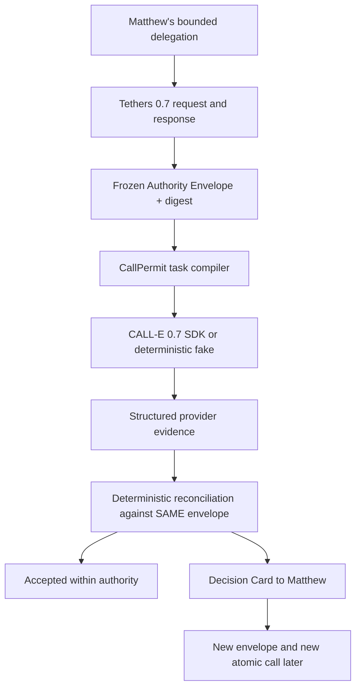

# CallPermit architecture

The fake and official SDK modules occupy the same narrow transport slot. The
official adapter is the only module that imports `@call-e/calle`; it is an
effect boundary and is never used by deterministic acceptance. Tethers is
pre-call authority; it is not a callback or interceptor inside the conversation.

The call record carries the envelope digest. Therefore a changed authority
cannot retroactively authorise an existing call, and a later envelope produces
a different atomic call identity.
